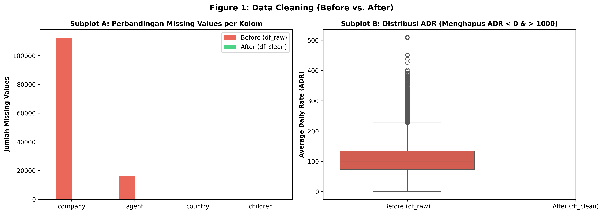
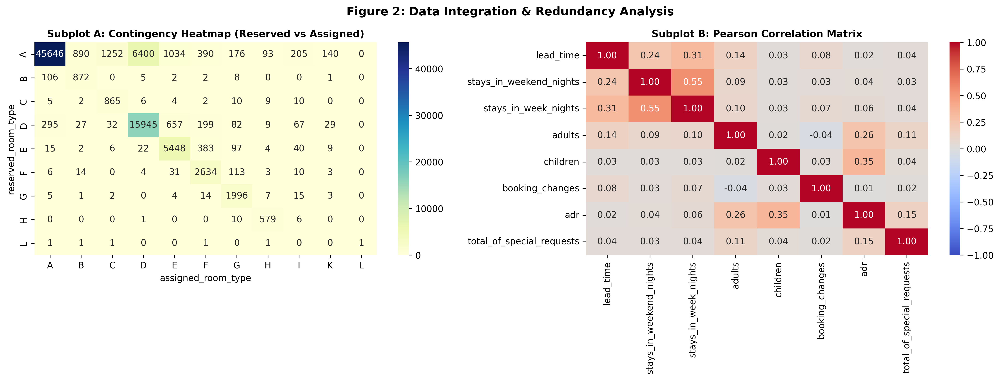
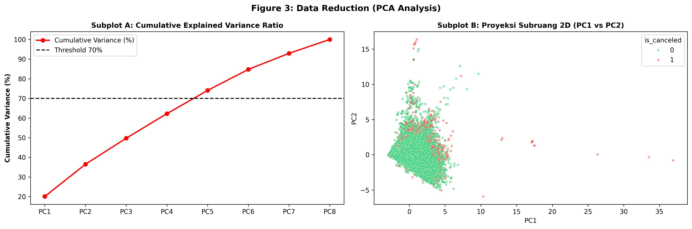
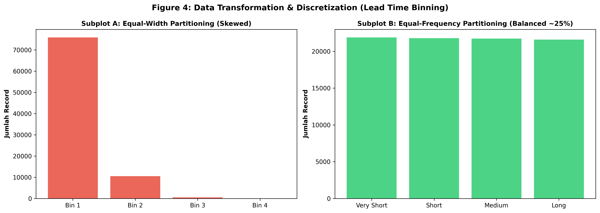

# Before vs. After Comparison: Evaluasi Mutu dan Transformasi Data

Bagian ini menyajikan evaluasi komparatif antara dataset mentah (*df_raw*) dan dataset hasil pemrosesan (*df_clean*) berdasarkan prinsip-prinsip prapemrosesan data menurut Jiawei Han (Data Mining: Concepts and Techniques, Bab 3). Evaluasi mencakup aspek kelengkapan (*completeness*), keunikan (*uniqueness*), konsistensi, dan akurasi nilai.

---

## 1. Tabel Komparasi Kuantitatif

Tabel berikut merangkum metrik integritas data sebelum dan sesudah penerapan pipeline prapemrosesan:

| Parameter Kualitas Data | Sebelum (*df_raw*) | Sesudah (*df_clean*) | Delta / Efek Pemrosesan |
|:---|:---:|:---:|:---|
| **Total Observasi (Baris)** | 119.390 | 86.970 | -32.420 (-27,15%) |
| **Total Dimensi (Kolom)** | 36 | 36 | Netto 0 (6 dibuang, 6 ditambahkan) |
| **Total Sel Kosong (*Missing Cells*)** | 129.425 | 0 | -129.425 (-100,00%) |
| **Baris Duplikat Riil** | 32.252 | 0 | -32.252 (-100,00%) |
| **Nilai ADR Invalid / Ekstrem** | 2 | 0 | Dieliminasi (ADR = -6,38 dan ADR = 5.400) |
| **Pemesanan Fiktif (0 Tamu)** | 166 | 0 | Dieliminasi (*adults + children + babies* = 0) |

### Rasionalisasi Perubahan Volume Data
Pengurangan volume data sebesar 32.420 baris (27,15%) merupakan konsekuensi langsung dari eliminasi redundansi dan pelanggaran aturan domain. Penurunan didominasi oleh penghapusan 32.252 baris duplikat riil yang sebelumnya terselubung oleh keberadaan identitas unik buatan (kolom PII). Sisanya, sebanyak 168 baris, merupakan observasi cacat yang terdiri atas 2 record pencilan harga sewa ekstrem/negatif dan 166 transaksi pemesanan tanpa tamu. Pada dimensi kolom, pembuangan 4 atribut PII (*name*, *email*, *phone-number*, *credit_card*) dan 2 atribut kebocoran data (*reservation_status*, *reservation_status_date*) diimbangi secara proporsional dengan penambahan 6 fitur turunan berbasis domain bisnis dan hierarki temporal (*total_stay_nights*, *is_room_changed*, *lead_time_category*, *arrival_date*, *arrival_quarter*, *arrival_season*).

---

## 2. Visualisasi dan Pembahasan Komparasi

### 2.1 Pembersihan Data dan Penanganan Anomali

Pembersihan data menyelesaikan dua permasalahan struktural utama:
1. **Penanganan Nilai Hilang (Subplot A):** Pada kondisi awal, atribut `company` mengalami ketiadaan data sebesar 94,31% (112.593 nilai), diikuti `agent` sebesar 13,69% (16.340 nilai), `country` sebesar 0,41% (488 nilai), dan `children` sebanyak 4 nilai. Seluruh sel kosong diimputasi secara deterministik berdasarkan logika domain: `children` diisi nilai 0 lalu dikonversi ke integer, `country` dikategorikan sebagai string `'Unknown'`, sedangkan `agent` dan `company` diimputasi dengan nilai 0 untuk merefleksikan pemesanan langsung tanpa perantara korporasi/agen. Prapemrosesan berhasil meniadakan seluruh missing values (0 sel tersisa).
2. **Stabilisasi Sebaran Nilai ADR (Subplot B):** Diagram kotak garis (*boxplot*) memperlihatkan bahwa sebelum dibersihkan, data memuat anomali berupa nilai negatif (ADR = -6,38) yang bertentangan dengan kaidah keuangan, serta pencilan ekstrem tunggal (ADR = 5.400,00) yang merusak dispersi statistik. Setelah kedua record tersebut difilter, distribusi ADR berada dalam rentang valid yang terkontrol (0 hingga 508), menstabilkan estimasi varians untuk tahap analisis lanjutan.

---

### 2.2 Integrasi Data dan Uji Redundansi

Pengujian redundansi dilakukan untuk memastikan tidak ada informasi yang terduplikasi secara sia-sia dalam ruang atribut:
1. **Uji Asosiasi Nominal Chi-Square (Subplot A):** Matriks kontingensi antara `reserved_room_type` dan `assigned_room_type` menghasilkan nilai statistik $\chi^2 = 387.036,71$ dengan derajat kebebasan ($df$) = 80 dan $p\text{-value} < 0,001$. Nilai ini menolak hipotesis independensi secara signifikan. Walaupun berasosiasi sangat kuat, atribut `assigned_room_type` dipertahankan karena selisih antara kamar yang dipesan dan kamar yang dialokasikan merefleksikan fenomena bisnis *room mismatch* (upgrade/downgrade), yang menjadi dasar pembentukan fitur prediktif `is_room_changed`.
2. **Analisis Korelasi Pearson Atribut Numerik (Subplot B):** Berdasarkan prinsip Jiawei Han, redundansi atribut numerik terjadi apabila korelasi antar-fitur mendekati sempurna ($|r| \ge 0,85$). Hasil kalkulasi menunjukkan korelasi tertinggi hanya terjadi antara `stays_in_weekend_nights` dan `stays_in_week_nights` dengan nilai $r = 0,550$ (kategori korelasi sedang). Seluruh pasangan atribut lainnya memiliki nilai $|r| < 0,35$. Hal ini membuktikan bahwa tidak ada redundansi multikolinearitas linier, sehingga seluruh 8 fitur numerik dipertahankan.

---

### 2.3 Reduksi Dimensi dan Proyeksi PCA

Reduksi dimensi dieksplorasi melalui *Principal Component Analysis* (PCA) pada 8 atribut numerik terstandarisasi ($Z$-score):
1. **Evaluasi Varians Kumulatif (Subplot A):** Komponen utama pertama (PC1) menyerap 20,07% varians dan komponen kedua (PC2) menyerap 16,42%, menghasilkan varians kumulatif 36,50% pada ruang 2 dimensi. Ambang batas retensi varians standar sebesar $\ge 70\%$ baru tercapai pada PC5 dengan nilai akumulasi 74,06%.
2. **Proyeksi Subruang 2D (Subplot B):** Diagram tebar (*scatter plot*) PC1 terhadap PC2 yang dikelompokkan berdasarkan variabel target pembatalan (`is_canceled`) menunjukkan adanya tumpang tindih (*overlap*) yang masif antara observasi batal (1) dan tidak batal (0). Kondisi ini mengindikasikan bahwa batas keputusan (*decision boundary*) antar-kelas tidak dapat dipisahkan secara linier sederhana pada proyeksi dua dimensi numerik murni.

---

### 2.4 Diskretisasi Fitur Temporal (Lead Time)

Fitur `lead_time` memiliki karakteristik distribusi miring ke kanan (*right-skewed*), di mana pemesanan terkonsentrasi pada jangka pendek tetapi memiliki ekor panjang hingga 737 hari:
1. **Kegagalan Partisi Equal-Width (Subplot A):** Pembagian rentang nilai matematis secara merata ke dalam 4 interval gagal mengakomodasi skewness data. Akibatnya, 75.878 observasi (87,24%) terkonsentrasi penuh pada Bin 1, sedangkan Bin 4 hanya memuat 26 record (0,03%). Struktur ini menyebabkan hilangnya daya diskriminasi informasi pada rentang waktu menengah dan panjang.
2. **Keberhasilan Partisi Equal-Frequency (Subplot B):** Metode partisi berbasis kuantil (*equal-depth*) berhasil membagi data secara proporsional ke dalam 4 kategori seimbang (masing-masing memuat $\approx 25\%$ data atau $\approx 21.700$ record):
   - `Very Short`: 0 hingga 11 hari.
   - `Short`: 12 hingga 49 hari.
   - `Medium`: 50 hingga 125 hari.
   - `Long`: lebih dari 125 hari.
   Hasil partisi ini diadopsi sebagai fitur baru `lead_time_category` untuk menstabilkan performa algoritma berbasis pohon maupun aturan asosiasi.

---

## 3. Kesiapan Data untuk Pemodelan Prediktif

Pipeline prapemrosesan menghasilkan dataset final berdaya guna tinggi (*ready-to-model*) dengan jaminan integritas matematis:
1. **Eliminasi Risiko Data Leakage dan Bias Overfitting:** Penghapusan variabel post-event (`reservation_status` dan `reservation_status_date`) meniadakan kebocoran informasi masa depan ke model prediktif, sedangkan pembuangan 4 atribut PII mencegah model menghafal identitas individu pelanggan.
2. **Integritas Distribusi Numerik dan Kelengkapan Data:** Penghapusan anomali nilai (ADR invalid dan reservasi 0 tamu) serta imputasi total nilai hilang memastikan kestabilan estimasi gradien dan parameter pada algoritma machine learning tanpa risiko galat eksekusi akibat nilai *NaN*.
3. **Pengayaan Semantik dan Kemampuan Analisis Multidimensi:** Penambahan fitur komposit (`total_stay_nights`, `is_room_changed`), diskretisasi kategorikal `lead_time_category`, serta hierarki temporal (`arrival_quarter`, `arrival_season`) memperluas kapasitas representasi data untuk pemodelan non-linier (Random Forest, XGBoost) maupun analisis kubus data OLAP.
